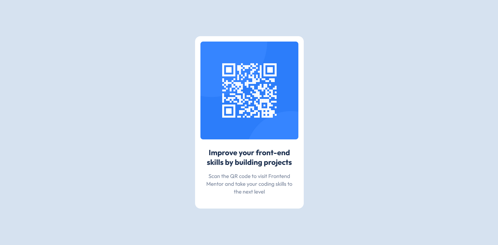

# Frontend Mentor - QR code component solution

This is a solution to the [QR code component challenge on Frontend Mentor](https://www.frontendmentor.io/challenges/qr-code-component-iux_sIO_H). Frontend Mentor challenges help you improve your coding skills by building realistic projects.

## Table of contents

- [Overview](#overview)
  - [Screenshot](#screenshot)
  - [Links](#links)
- [My process](#my-process)
  - [Built with](#built-with)
  - [Continued development](#continued-development)
- [Author](#author)

**Note: Delete this note and update the table of contents based on what sections you keep.**

## Overview

### Screenshot

### Links

- Solution URL: [Solution url](https://github.com/nachtstern3476/frontendmaster/tree/master/social-media-dashboard-with-theme-switcher-master)
- Live Site URL: [Live site url](https://nachtstern3476.github.io/frontendmaster/social-media-dashboard-with-theme-switcher-master)

## My process

### Built with

- Flexbox
- Mobile-first workflow

### Continued development

Still need a development on naming classes and html structure

**Note: Delete this note and the content within this section and replace with your own plans for continued development.**

## Author

- Website - [nachtstern3476](https://nachtstern3476.github.io)
- Frontend Mentor - [@nachtstern3476](https://www.frontendmentor.io/profile/nachtstern3476)
