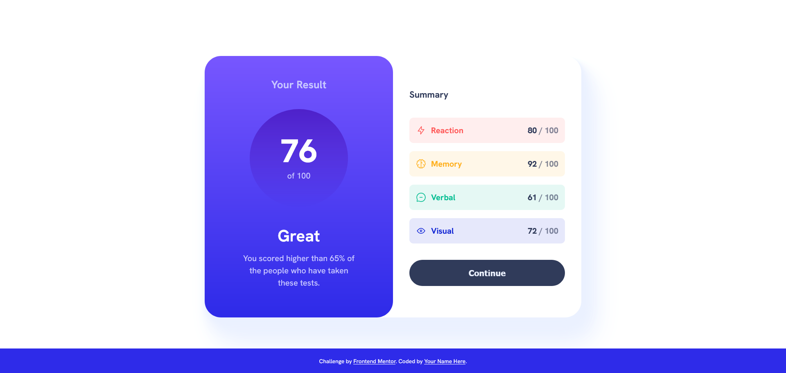

# Frontend Mentor - Results summary component solution

This is a solution to the [Results summary component challenge on Frontend Mentor](https://www.frontendmentor.io/challenges/results-summary-component-CE_K6s0maV). Frontend Mentor challenges help you improve your coding skills by building realistic projects.

## Table of contents

- [Overview](#overview)
  - [The challenge](#the-challenge)
  - [Screenshot](#screenshot)
  - [Links](#links)
- [My process](#my-process)
  - [Built with](#built-with)
  - [What I learned](#what-i-learned)
  - [Continued development](#continued-development)
  - [Useful resources](#useful-resources)
- [Author](#author)
- [Acknowledgments](#acknowledgments)

## Overview

### The challenge

Users should be able to:

- View the optimal layout for the interface depending on their device's screen size
- See hover and focus states for all interactive elements on the page

### Screenshot

### Links

- Solution URL: [Solution url](https://github.com/nachtstern3476/frontendmaster/tree/master/results-summary-component-main)
- Live Site URL: [Live site url](https://nachtstern3476.github.io/frontendmaster/results-summary-component-main)

## My process

### Built with

- Semantic HTML5 markup
- Flexbox
- A little bit of Grid
- Mobile-first workflow
- Vanila JS

### What I learned

In this challenge i tried to use semantic HTML5 markup and using vanila js for fething data in `data.json` file.

I also start putting an effort on how to make the css code as DRY as posible by writing only necessary style only.

Well for now it's not perfect yet but practice makes improvement, so let's gooo to the next challange....

### Continued development

For the next challenge i will keep using semantic HTML5 and css.

With the goal is to be good at writing html and css. Not only create and style a good website but create and style a good and working website

## Author

- Website - [nachtstern3476](https://nachtstern3476.github.io)
- Frontend Mentor - [@nachtstern3476](https://www.frontendmentor.io/profile/nachtstern3476)
